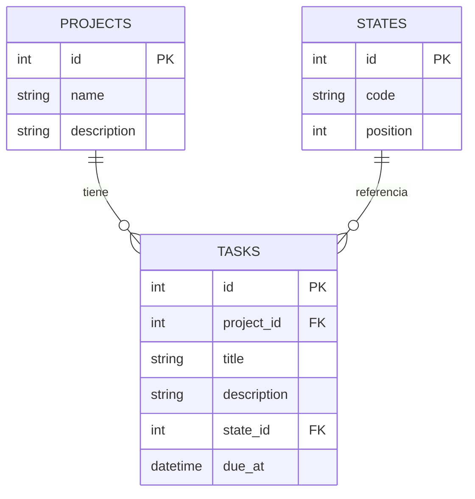

# Esquema de datos

Generado por la skill `describir-esquema` a partir de `app/models.py` y la
cadena real de `alembic/versions/` (`03c6bd17971f → 13125b9918d2 →
812c17059bbc → be4da458c13a → 86adfc988d43`). El comportamiento observable
—códigos de estado, forma de la respuesta, validación— está en
[`docs/contrato-api.md`](contrato-api.md); aquí solo se enlaza.

## Diagrama

## Diccionario de datos

### `states`

| Columna | Tipo | Nulo | Significado |
|---|---|---|---|
| `id` | `INTEGER` | NO | — |
| `code` | `VARCHAR` | NO | Único. El catálogo cerrado que fija [Estados](contrato-api.md#estados). |
| `position` | `INTEGER` | NO | Campo de orden del catálogo (1-4, sembrado por `13125b9918d2`) que usa [`GET /states`](contrato-api.md#orden-de-las-listas) para ordenar; no es el `id`. |

### `projects`

| Columna | Tipo | Nulo | Significado |
|---|---|---|---|
| `id` | `INTEGER` | NO | — |
| `name` | `VARCHAR` | NO | — |
| `description` | `VARCHAR` | SÍ | — |

### `tasks`

| Columna | Tipo | Nulo | Significado |
|---|---|---|---|
| `id` | `INTEGER` | NO | — |
| `project_id` | `INTEGER` | NO | FK a `projects.id`, sin `ondelete`: la base bloquea el borrado de un proyecto con tareas, no solo el [`409` del endpoint](contrato-api.md#proyectos). |
| `title` | `VARCHAR` | NO | Sin `CHECK` en la base: la regla de [normalización de texto](contrato-api.md#normalización-de-texto) (rechazar título sin ningún carácter visible) es responsabilidad exclusiva de la API. |
| `description` | `VARCHAR` | SÍ | — |
| `state_id` | `INTEGER` | NO | FK a `states.id`, sin `ondelete`; mismo efecto que `project_id`. |
| `due_at` | `TIMESTAMP WITH TIME ZONE` | SÍ | Ver [Tareas v2: Fechas Límite](contrato-api.md#tareas-v2-fechas-límite) para su semántica (`overdue`, normalización a UTC). Columna añadida en `86adfc988d43`, nula por compatibilidad con las tareas creadas en v1. |
